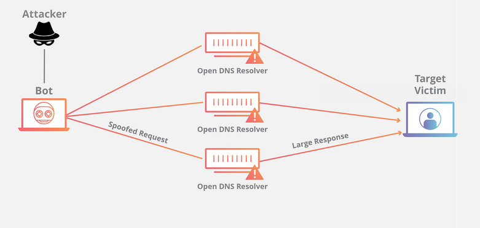
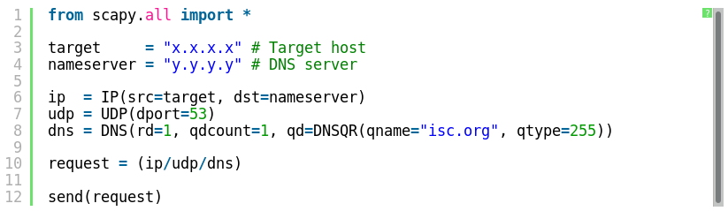

# DNS Amplification Lab

  

In this lab we will use [Docker](https://www.docker.com/get-started) & [Scapy](https://scapy.net/).  

## Lab Overview
DNS (Domain Name System) is the Internet’s phone book; it translates hostnames to IP addresses (or IP
addresses to hostnames). This translation is through DNS resolution, which happens behind the scene.  
DNS amplification attack is a sophisticated denial of service attack that takes advantage of DNS server behavior in order to amplify the attack. This attack is a new type of attack which utilizes the fact that size of response generated by DNS can be much larger than DNS request query. This attack is feasible only in case of recursive DNS server. The huge amount of traffic generated by DNS server is utilized to flood the target server i.e victim to establish denial of service attack. Two malicious tasks are performed by attacker to launch DNS Amplification Attack on victim.

A DNS amplification can be broken down into four steps:

- The attacker uses a compromised endpoint to send UDP packets with spoofed IP addresses to a DNS recursor. The spoofed address on the packets points to the real IP address of the victim.
- Each one of the UDP packets makes a request to a DNS resolver, often passing an argument such as “ANY” in order to receive the largest response possible.
- After receiving the requests, the DNS resolver, which is trying to be helpful by responding, sends a large response to the spoofed IP address.
- The IP address of the target receives the response and the surrounding network infrastructure becomes overwhelmed with the deluge of traffic, resulting in a denial-of-service.

While a few requests is not enough to take down network infrastructure, when this sequence is multiplied across multiple requests and DNS resolvers, the amplification of data the target receives can be substantial.  

## Lab Environment  
If Docker is not installed on your computer, install it now.  
Pulling the images for the lab:
- Sniff container(our target):  
`docker pull avielyosef/ubuntu-dns-amplification:sniff` 
- Attacker container:  
`docker pull avielyosef/ubuntu-dns-amplification:attacker`

- DNS container:  
`docker pull andyshinn/dnsmasq`

Create Docker network: `docker network create myLab`.
  
Run and connect to Sniff:  
- `docker run --rm -ti --net myLab --name Sniff avielyosef/ubuntu-dns-amplification:sniff`
  
Run and connect to Attacker:  
- `docker run --rm -ti --net myLab --name Attacker avielyosef/ubuntu-dns-amplification:attacker`  

Run DNS1 on background:  
- `docker run --rm -d --net myLab --name DNS1 --cap-add=NET_ADMIN andyshinn/dnsmasq`

Run DNS2 on background:  
- `docker run --rm -d --net myLab --name DNS2 --cap-add=NET_ADMIN andyshinn/dnsmasq`

Run DNS3 on background:  
- `docker run --rm -d --net myLab --name DNS3 --cap-add=NET_ADMIN andyshinn/dnsmasq`

## Lab Tasks

### Task 1: Run `basic_script`.
**NOTE:** To resolve an IP from a running container run `docker inspect <container_name>`, for example: `docker inspect Sniff`. 

Here we can see a screenshot of `basic_script` from the Attacker container.
Modify this script to send a DNS request with Sniff's IP, you can use any DNS container you want for this task.   
Then run: `sudo python basic_script`. 

Describe what do you see on Sniff's screen?

### Task 2: Improve `basic_script`.
Now that we understand how to spoof our own DNS packets, lets improve our code!

To see the load on the network open a new terminal and run: `docker exec -ti Sniff bash`, you should see Sniff's terminal, run `bmon`.

#### Task 2.1: loop it!
Modify our `basic_script` to send spoofed DNS requests in a loop! you can use any DNS container you want for this task. 

#### Task 2.2: getting greedy

Create `SERVERS.txt` & `DOMAINS.txt`, inside `SERVERS.txt` put the DNS's IPs in a separate lines, inside `DOMAINS.txt` put domain addresses in a separate lines.

Create your own script or build it on top of `basic_script`, use `SERVERS.txt` & `DOMAINS.txt` inside your script in order to use all 3 DNS containers with different domain queries.

## Finish up

### Stop containers
Run `docker container stop <container_name>`, for example: `docker container stop Sniff`.

**NOTE:** Don't forget to stop all 5 containers.